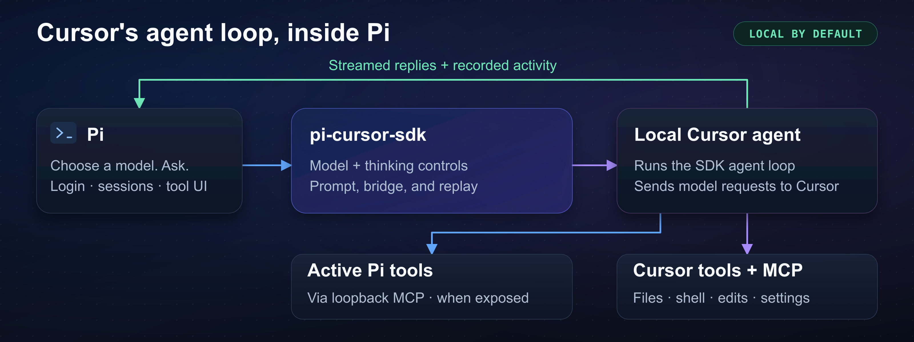

# pi-cursor-sdk

Use Cursor models in [Pi](https://pi.dev)'s terminal UI. `pi-cursor-sdk` runs Cursor's SDK agent and connects it to Pi sessions and extension tools.



*The agent runs locally. It sends model requests to Cursor and returns replies and tool activity to Pi.*

## Quick start

Requirements: Node.js 24+, Pi 0.87.1+, and an API key for Cursor SDK. The package installs `@cursor/sdk` for you.

Use a user key from Cursor Dashboard → API Keys or a service-account key from Team settings. Team Admin keys do not work. Cursor Desktop and Agent CLI login do not supply the SDK key.

```bash
pi install npm:pi-cursor-sdk
pi --model cursor/grok-4.6
```

Inside Pi:

1. Run `/login`.
2. Select **Use an API key → Cursor**.
3. Paste your key.
4. Run `/cursor-refresh-models`.
5. Enter your prompt.

Keep your key out of `cursor-sdk.json` and shared logs. See [installation options](docs/reference.md#install) for GitHub and project-local installs.

## Models and controls

Use `/model` to select a model. Use these commands to select a model at startup:

```bash
pi --model cursor/gpt-5.5@1m --thinking medium
pi --model cursor/grok-4.6:slow
```

The `cursor/` prefix selects this provider. `@1m` selects a context window from Cursor's catalog. `--thinking` sets the thinking level when Cursor exposes that control. Models with Cursor's `fast` parameter also have `:fast` and `:slow` choices.

Run `pi --list-models cursor` to see available models. Startup can use a cached or fallback catalog. A model in the list does not prove that your key works.

Run these commands inside Pi:

| Command | Action |
| --- | --- |
| `/cursor-fast` | Toggle and save fast mode for the selected model, when supported. Select the model without `:fast` or `:slow` to change its default. |
| `/cursor-mode plan` | Use Cursor plan mode. Use `/cursor-mode agent` to return to agent mode. |
| `/cursor-refresh-config` | Reload filesystem settings in the current Cursor agent. |

For one run, pass `--cursor-fast`, `--cursor-no-fast`, or `--cursor-mode plan`. See the [model reference](docs/reference.md#choosing-a-model) for selection rules and [fast mode](docs/reference.md#fast-mode) for saved preferences.

The footer shows status such as `cursor:local · fast:off`, with `plan` or `http1` when enabled. Set `PI_CURSOR_FOOTER=0` to hide the Cursor status.

## Tools and settings

Cursor controls file tools, shell commands, edits, and configured MCP servers. The local MCP bridge exposes active Pi extension tools as `pi__*` names. The bridge is on by default. Pi hides matching built-ins from the bridge by default.

**Pi's `--no-tools`, `--tools`, and `--exclude-tools` do not disable Cursor tools or Cursor MCP servers.** Use Cursor settings to change those tools.

Local runs leave Cursor auto-review and sandboxing off by default. Read the [safety controls and hook limits](docs/reference.md#cursor-local-agent-config-and-safety-controls) before you depend on those controls or Cursor hooks.

```bash
# Disable the Pi tool bridge.
PI_CURSOR_PI_TOOL_BRIDGE=0 pi --model cursor/grok-4.6

# Disable Cursor settings, rules, plugins, and MCP configuration loaded from disk.
PI_CURSOR_SETTING_SOURCES=none pi --model cursor/grok-4.6
```

Cursor activity cards show recorded results. They do not run tools again. Cursor plan and todo cards do not control Pi's separate plan-mode extension or Pi todos.

See [tool surfaces](docs/cursor-tool-surfaces.md) for bridge options and [native replay](docs/cursor-native-tool-replay.md) for activity cards and SDK limits.

## Sessions and images

The extension reuses a Cursor agent for compatible local turns. Pi can reconnect to a recorded local agent after a restart. If reconnect fails, the extension starts a new agent from the Pi transcript and shows a continuity note. See [resume and storage](docs/reference.md#cursor-local-agent-config-and-safety-controls) for matching rules and cleanup commands.

Images in the current request go to Cursor. Earlier images become placeholders in the transcript. Reattach an image for a later question about it.

## Usage

Pi's default footer and `/stats` keep their native context accounting. Use these commands for separate Cursor billing data:

```text
/cursor-usage
/cursor-usage refresh
/cursor-usage export cursor-usage.json
```

Refresh requests public billing data without a model prompt. Export creates a private JSON file and does not overwrite existing files. Billing data can lag or change. It is not a final invoice.

Check paths and identifiers before you share an export. See [usage and journal recovery](docs/reference.md#context-compaction-and-cursor-usage) for details.

## Optional Cursor Cloud

Local is the default. Run `/cursor-runtime cloud` to see the first-use confirmation. Cloud can commit, push, and open PRs. It uses Max Mode billing at Cursor API pricing.

Cloud requires a persisted Pi session and starts with fresh context by default. Cloud has no local Pi tool bridge or Pi environment forwarding. Cloud agents remain in Cursor until you explicitly archive or delete them.

Run `/cursor-cloud list` to see agents recorded for your session branch. Read the [Cloud setup and cleanup guide](docs/reference.md#cloud-runtime-and-acknowledgement) before you start a remote run.

## Troubleshooting

| Problem | Action |
| --- | --- |
| Models appear, but a run fails | Run `/login` with an API key for Cursor SDK. Run `/cursor-refresh-models`. |
| First reply is slow | Check configured Cursor MCP servers. Read [settings and connection limits](docs/reference.md#first-cursor-message-is-slow-10-seconds). |
| Streams fail behind a VPN or proxy | Run `/cursor-http on`. This changes the local SDK transport only. |
| Fallback catalog remains with a saved key | Read the [startup refresh limit](docs/reference.md#model-catalog-cache) for official Pi 1.0.4 and 1.1.0. |

See [Troubleshooting](docs/reference.md#troubleshooting) for other problems. [Report a bug](https://github.com/fitchmultz/pi-cursor-sdk/issues) with Pi/extension versions, model, flags, exact prompt, and a redacted session.

Debug artifacts can contain secrets. Remove secrets before you share them.

## Reference and development

The [full reference](docs/reference.md) contains detailed configuration and limits. [Development](docs/development.md) covers checks, model snapshots, and release procedures. The [model UX spec](docs/cursor-model-ux-spec.md) contains maintainer design notes. The [Changelog](CHANGELOG.md) records version history.

## License

[MIT](LICENSE) · Mitch Fultz
